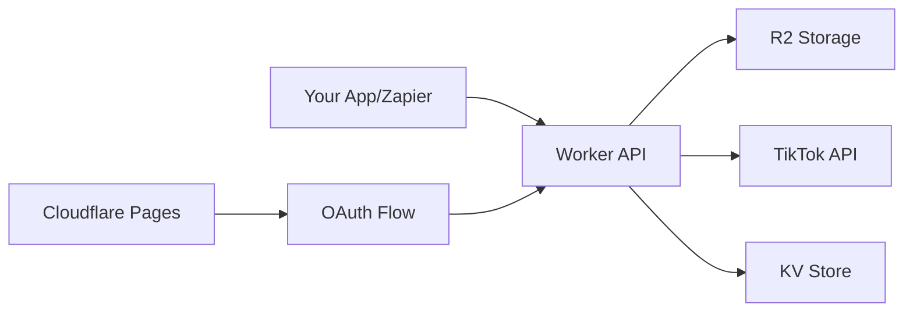

# 🎵 R2 TikTok Upload

A serverless solution that automatically uploads videos from Cloudflare R2 storage to TikTok using the official TikTok Open API. Built with Cloudflare Workers, R2, and Pages.


## ✨ Features

- 🚀 **Serverless**: Built on Cloudflare Workers for global edge deployment
- 🔐 **Secure OAuth**: Official TikTok OAuth 2.0 integration
- 📹 **R2 Integration**: Direct uploads from Cloudflare R2 buckets
- 🎯 **Idempotent**: Safe for retries and automation tools like Zapier
- 🕒 **Scheduled Cleanup**: Automatic token and temporary file management
- 🌐 **Custom Domain**: Use your own verified media domain for TikTok
- 📝 **Publish or Draft**: Choose to publish immediately or save as draft

## 🏗️ Architecture



## 📋 Prerequisites

Before setting up this project, you'll need:

- **Cloudflare Account** (Free tier works)
- **TikTok Developer Account** with approved app
- **Custom Domain** verified with TikTok for media hosting
- **Node.js** 18+ and npm
- **Wrangler CLI** installed globally

## 🚀 Quick Start

### 1. Clone and Install

```bash
git clone https://github.com/your-username/r2-tiktok-upload.git
cd r2-tiktok-upload
npm install
```

### 2. TikTok App Setup

1. Go to [TikTok Developers](https://developers.tiktok.com/)
2. Create a new app with these scopes:
   - `video.upload`
   - `video.publish` (optional, for direct publishing)
3. Add your callback URL: `https://your-worker.your-subdomain.workers.dev/callback`
4. Note your **Client Key** and **Client Secret**

### 3. Cloudflare Resources Setup

#### Create R2 Bucket
```bash
wrangler r2 bucket create your-bucket-name
```

#### Create KV Namespace
```bash
wrangler kv:namespace create "TOKENS_KV"
```

#### Set up Custom Domain (Required for TikTok)
1. Add a custom domain to your R2 bucket in the Cloudflare dashboard
2. Verify this domain with TikTok as a media hosting domain
3. Note the custom domain URL

### 4. Configure Environment

#### Update `wrangler.toml`
```toml
name = "r2-tiktok-upload"
main = "src/index.ts"
compatibility_date = "2024-10-01"
account_id = "YOUR_ACCOUNT_ID"

[[kv_namespaces]]
binding = "TOKENS_KV"
id = "YOUR_KV_NAMESPACE_ID"

[vars]
SCOPES = "video.upload,video.publish"
AUTHORIZE_URL = "https://www.tiktok.com/v2/auth/authorize/"
TOKEN_URL = "https://open.tiktokapis.com/v2/oauth/token/"
POST_INIT_URL = "https://open.tiktokapis.com/v2/post/publish/video/init/"
CUSTOM_MEDIA_HOST = "your-custom-domain.com"
R2_BUCKET = "your-bucket-name"
PURGE_DRY_RUN = "true"
PURGE_PENDING_MAX_HOURS = "24"
PURGE_REMOVE_UNMATCHED = "true"

[triggers]
crons = ["0 5 * * *"]  # Daily cleanup at 5 AM UTC
```

#### Set Secrets
```bash
# TikTok API credentials
wrangler secret put TIKTOK_CLIENT_KEY
wrangler secret put TIKTOK_CLIENT_SECRET

# Your worker's callback URL
wrangler secret put OAUTH_REDIRECT_URL
# Example: https://r2-tiktok-upload.your-name.workers.dev/callback

# R2 credentials (from Cloudflare dashboard -> R2 -> Manage R2 API tokens)
wrangler secret put R2_ACCESS_KEY_ID
wrangler secret put R2_SECRET_ACCESS_KEY

# Optional: API key for webhook authentication
wrangler secret put POST_API_KEY
```

### 5. Deploy

```bash
# Deploy the Worker
npm run deploy

# Deploy the static site (optional)
wrangler pages deploy html --project-name r2-tiktok-upload-site
```

## 🔧 Configuration

### Environment Variables

| Variable | Description | Required |
|----------|-------------|----------|
| `TIKTOK_CLIENT_KEY` | Your TikTok app's client key | ✅ |
| `TIKTOK_CLIENT_SECRET` | Your TikTok app's client secret | ✅ |
| `OAUTH_REDIRECT_URL` | Your worker's `/callback` endpoint | ✅ |
| `R2_ACCESS_KEY_ID` | R2 API token access key | ✅ |
| `R2_SECRET_ACCESS_KEY` | R2 API token secret | ✅ |
| `R2_BUCKET` | Name of your R2 bucket | ✅ |
| `CUSTOM_MEDIA_HOST` | Your TikTok-verified domain | ✅ |
| `POST_API_KEY` | Optional API key for webhook auth | ❌ |

### Wrangler Variables

| Variable | Description | Default |
|----------|-------------|---------|
| `SCOPES` | TikTok API scopes | `video.upload,video.publish` |
| `PURGE_DRY_RUN` | Only log what would be deleted | `true` |
| `PURGE_PENDING_MAX_HOURS` | Max age for pending uploads | `24` |

## 📖 Usage

### 1. Authorize TikTok Access

Visit your worker URL and click "Grant TikTok Access" to complete the OAuth flow.

### 2. Upload Videos

#### Option A: By Video ID
```bash
curl -X POST https://your-worker.workers.dev/webhook \\
  -H "Content-Type: application/json" \\
  -H "Authorization: Bearer YOUR_API_KEY" \\
  -d '{
    "id": "my-video-123",
    "caption": "Check out this amazing video!",
    "mode": "publish",
    "idempotencyKey": "unique-key-123"
  }'
```

#### Option B: By R2 URL
```bash
curl -X POST https://your-worker.workers.dev/webhook \\
  -H "Content-Type: application/json" \\
  -H "Authorization: Bearer YOUR_API_KEY" \\
  -d '{
    "r2Url": "https://account.r2.cloudflarestorage.com/bucket/video.mp4?params...",
    "caption": "Direct from R2!",
    "mode": "draft",
    "idempotencyKey": "unique-key-456"
  }'
```

### 3. Response Format

```json
{
  "ok": true,
  "status": "accepted",
  "tiktok": {
    "data": {
      "publish_id": "xxxx-xxxx-xxxx",
      "request_id": "yyyy-yyyy-yyyy"
    }
  }
}
```

### 4. Integration with Zapier

1. Use the webhook URL as a Zapier action
2. Set the `idempotencyKey` to `{{zap_meta_uuid}}` for automatic deduplication
3. Use the `mode` field to control publish vs draft

## 🛠️ Development

### Local Development
```bash
npm run dev
```

### Testing
```bash
# Test the health endpoint
curl https://your-worker.workers.dev/health

# Test OAuth debug info
curl https://your-worker.workers.dev/debug-auth
```

### Logs
```bash
wrangler tail
```

## 🔒 Security

- **API Keys**: Use the optional `POST_API_KEY` for webhook authentication
- **OAuth Tokens**: Stored securely in Cloudflare KV with automatic expiration
- **Idempotency**: Prevents duplicate uploads using `idempotencyKey`
- **Domain Verification**: Only works with TikTok-verified media domains

## 🧹 Maintenance

### Automatic Cleanup
The worker runs a daily cron job (5 AM UTC) to:
- Remove expired OAuth tokens
- Clean up temporary files
- Remove unmatched pending uploads

### Manual Operations
```bash
# Check current tokens
wrangler kv:key list --namespace-id YOUR_KV_ID

# Force cleanup (set PURGE_DRY_RUN to false)
curl https://your-worker.workers.dev/cleanup
```

## 📁 Project Structure

```
r2-tiktok-upload/
├── src/
│   ├── index.ts          # Main Worker logic
│   ├── signer.ts         # R2 URL signing utilities
│   └── shims.ts          # Node.js compatibility shims
├── html/                 # Static site files
│   ├── index.html        # Main landing page
│   ├── privacy-policy.html
│   ├── tos.html
│   └── img/              # Assets
├── wrangler.toml         # Cloudflare Worker config
├── package.json
├── tsconfig.json
└── README.md
```

## 🐛 Troubleshooting

### Common Issues

**"Cannot find name 'ScheduledController'"**
```bash
npm install --save-dev @cloudflare/workers-types
```

**"Invalid redirect_uri"**
- Check your `OAUTH_REDIRECT_URL` matches your TikTok app config
- Ensure the URL ends with `/callback`

**"Media domain not verified"**
- Your `CUSTOM_MEDIA_HOST` must be verified with TikTok
- Check TikTok Developer Console → Your App → Settings

**R2 signing errors**
- Verify your R2 API tokens have the correct permissions
- Ensure the bucket name matches your configuration

### Debug Mode

Set `PURGE_DRY_RUN = "true"` to see what cleanup operations would run without executing them.

## 📄 License

MIT License - see [LICENSE](LICENSE) for details.

## 🤝 Contributing

1. Fork the repository
2. Create a feature branch (`git checkout -b feature/amazing-feature`)
3. Commit your changes (`git commit -m 'Add amazing feature'`)
4. Push to the branch (`git push origin feature/amazing-feature`)
5. Open a Pull Request

## 📞 Support

- **Issues**: [GitHub Issues](https://github.com/george-m8/r2-tiktok-upload/issues)
- **Documentation**: [TikTok Open API Docs](https://developers.tiktok.com/)
- **Cloudflare**: [Workers Documentation](https://developers.cloudflare.com/workers/)

---

Made with ❤️ using [Cloudflare Workers](https://workers.cloudflare.com/) and [TikTok Open API](https://developers.tiktok.com/)
